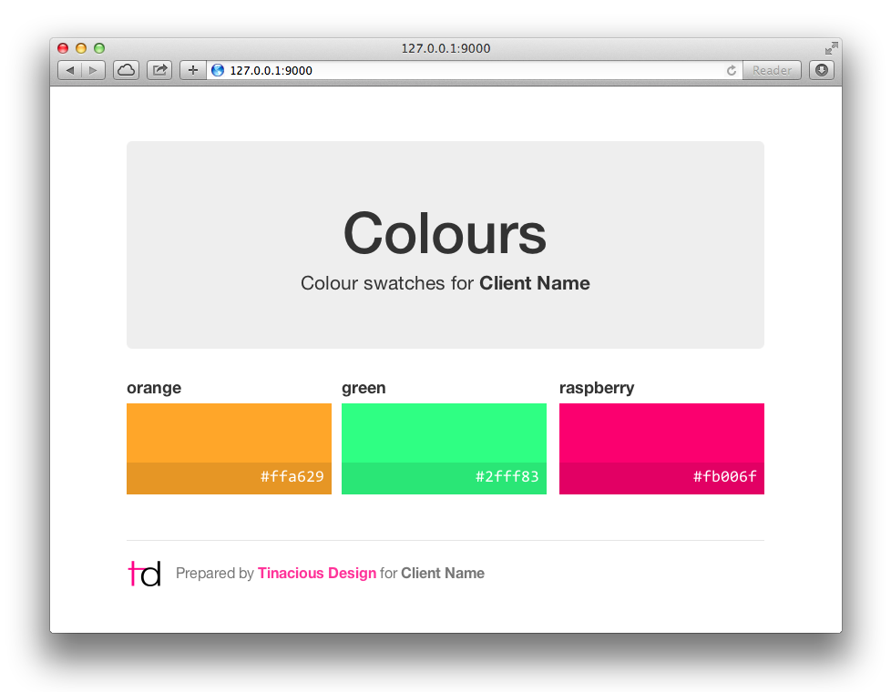

This repo is deprecated. See a living version here: https://codepen.io/tinacious/pen/pobYoWj

----

# Colour Swatches

A small Angular app designed to display colour swatches nicely.




## Development

Clone the repository.

Get the development environment setup:

    npm install
    bower install
    grunt server

Change the branding in the footer to your own.

Add colours in the `main.js` file:

```js
$scope.colours = [
  { name: 'orange', code: 'ffa629' },
  { name: 'green', code: '2fff83' },
  { name: 'raspberry', code: 'fb006f' }
];
```

### Colour grid

There are styles already set up for 3-up, 4-up, and 6-up grids in `app/styles/main.scss` starting at line 102.

The default is 3-up but feel free to comment-out the 3-up grid and uncomment another of your choice:

```scss
// 3-up
width: 32.20339%;
&:nth-child(3n) {
  float: right;
  margin-right: 0;
}

// 4-up
// width: 23.72881%;
// &:nth-child(4n) {
//   float: right;
//   margin-right: 0;
// }

// 6-up
// width: 15.25424%;
// &:nth-child(6n) {
//   float: right;
//   margin-right: 0;
// }
```


## Distribution

Build a minified version of the colour swatches:

    grunt build
